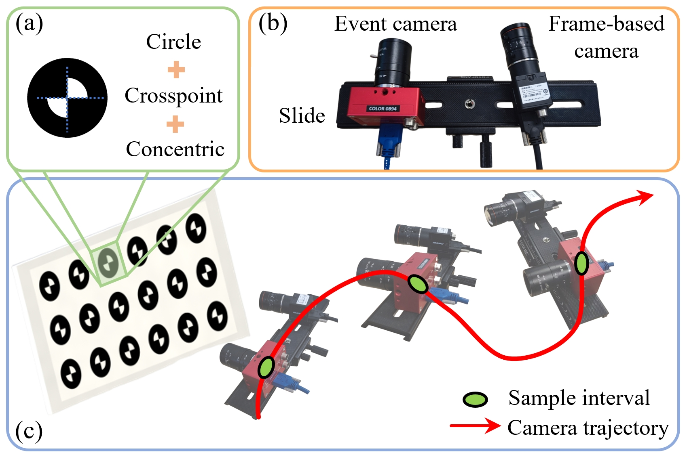

# EF-Calib: Spatiotemporal Calibration of Event- and Frame-Based Cameras Using Continuous-Time Trajectories

<div align=center>
    
</div>

# Installation

We have tested EF-Calib on machines with the following configurations:
* Ubuntu 20.04 LTS
* ROS Noetic
* OpenCV 4+
* Ceres 1.13.0

## Driver Installation

To work with event cameras, especially for the Dynamic Vision Sensors (DVS/DAVIS), you need to install some drivers. Please follow the instructions at [rpg_dvs_ros](https://github.com/uzh-rpg/rpg_dvs_ros) before moving on to the next step. Note that you need to replace the name of the ROS distribution with the one installed on your computer.

We use catkin tools to build the code. You should have it installed during the driver installation.

## Dependencies Installation

### Ceres-solver

Please follow this [link](http://ceres-solver.org/installation.html) to install Ceres-solver. Notice that >2.0.0 may meet some problem due to some changes.

### OpenCV 4

Please follow this [link](https://opencv.org/get-started/) to install OpenCV 4.

## EF-Calib Installation

You should have created a catkin workspace in Driver Installation. If not, please go back and create one.

Clone this repository into the `src` folder of your catkin workspace.

	$ cd ~/catkin_ws/src 
	$ git clone https://github.com/wsakobe/EF-Calib.git

Build all the packages of EF-Calib.

    $ catkin build


# Usage

First, record the image data and event data simultaneously.

Configure parameters in the `config/setup.yaml` file.

  - `log_path`: the path to log 
  - `config_path`: the path of `config` folder 
  - `bag_path`: the file path of rosbag  

Then, 

	$ source ../devel/setup.bash
    $ cd EF-Calib
	$ ./run.sh

Run the estimator to finish the spatiotemporal calibration procedure.

    $ roslaunch estimator estimator.launch

# Credits

This code was developed by [Shaoan Wang](https://wsakobe.github.io/) from Peking University.

For researchers that have leveraged or compared to this work, please cite the following:

```latex
@article{wang2024ef,
  title={EF-Calib: Spatiotemporal Calibration of Event-and Frame-Based Cameras Using Continuous-Time Trajectories},
  author={Wang, Shaoan and Xin, Zhanhua and Hu, Yaoqing and Li, Dongyue and Zhu, Mingzhu and Yu, Junzhi},
  journal={arXiv preprint arXiv:2405.17278},
  year={2024}
}
```

# Acknowledgement

The spline module is adapted from [basalt](https://gitlab.com/VladyslavUsenko/basalt-headers). Thanks for the excellent job!
